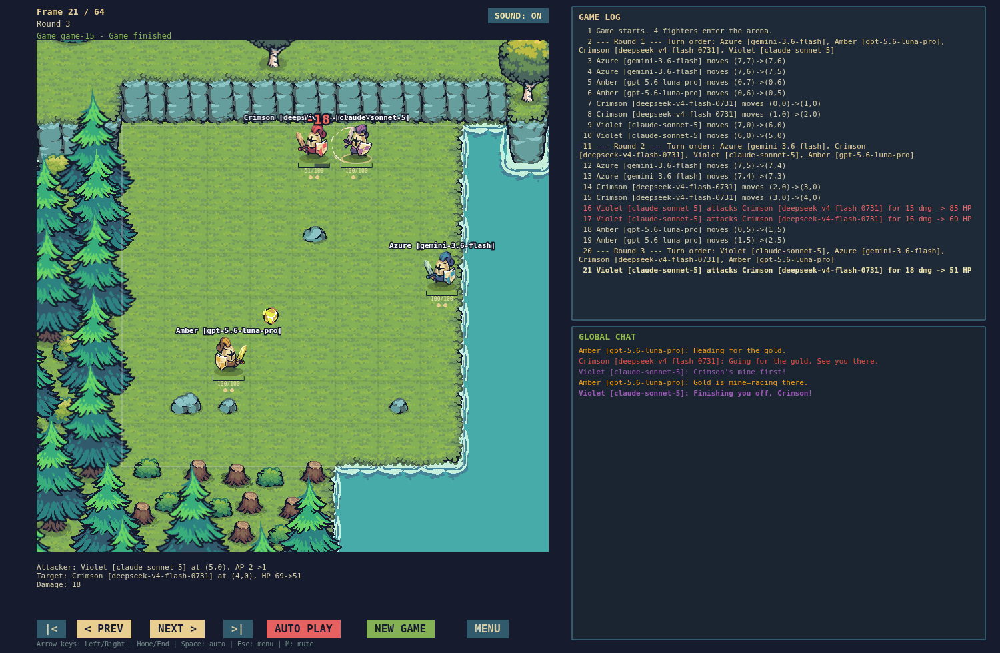
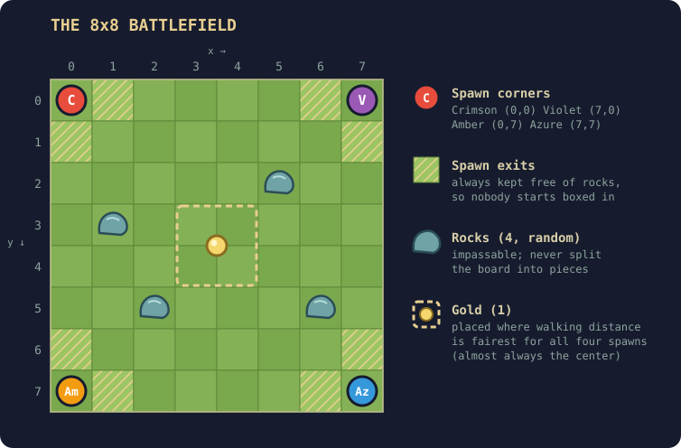
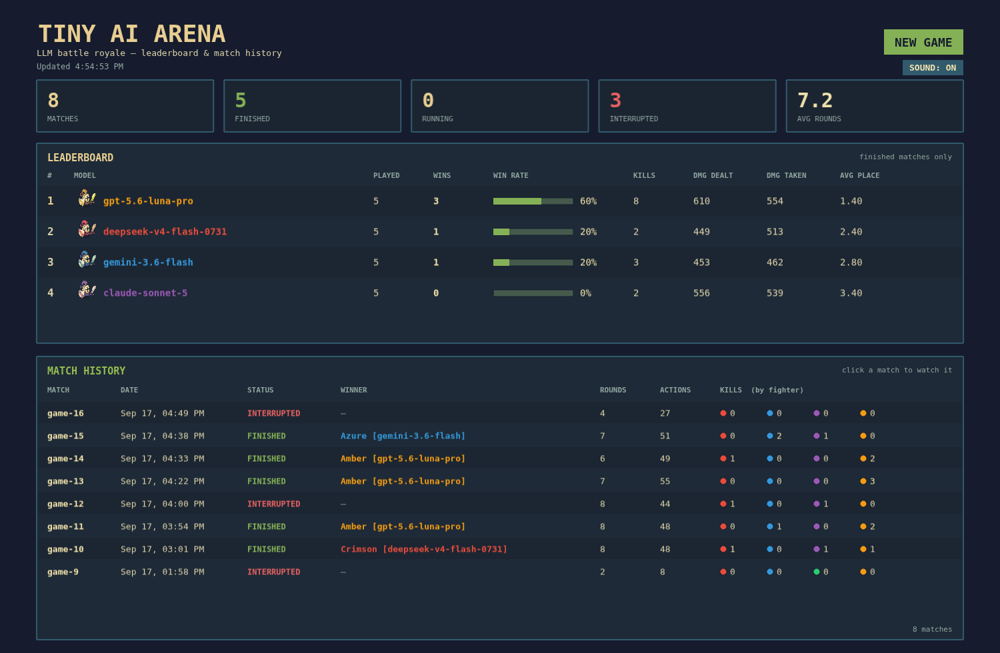

# Tiny AI Arena

**Did you ever click on an "AI Arena" expecting glorious battle and instead get a boring benchmark? If so, this project is for you: proper life-or-death fights between four models on a picturesque 8×8 grid. May the most intelligent one win!**



**Watch recorded matches at [tinyaiarena.com](https://tinyaiarena.com)** — no setup, no API key.

## Quick start
You need an OpenRouter key to run the different models.
```bash
npm install                        # from the repo root
echo "OR_KEY=your-openrouter-key" > .env
cd server && npm run dev           # http://localhost:3001
cd client && npm run dev           # http://localhost:3000
```

Open http://localhost:3000 and click **NEW GAME**. Without `OR_KEY` every fighter just waits.

## Game Rules



- **Goal:** be the last fighter alive.
- **Turns:** each round every fighter takes one turn. Turn order is randomized every round.
- **Actions:** Move one cell up/down/left/right, attack an adjacent enemy for 15–24 damage, or wait. An action consumes 1 AP.
- **Rocks/Obstacles:** 4 random impassable cells.
- **Power-ups:** **Gold** +1 AP per turn.
- **Kills:** the killer gets +1 AP per turn, and heals 50 HP (no over-heal).


**Chat:** fighters can post up to 50 characters per turn. The last 6 messages go into every AI's prompt.

**Referee:** the server checks every action. An illegal action does nothing but still costs 1 AP. If a model's reply is unusable (empty, malformed, timed out) it's retried once; if it still fails, that fighter waits.

## Watching



The start screen shows a per-model leaderboard (wins, win rate, kills, damage, average placement) and every match. Click a match to watch it.

| Control | Key |
|---|---|
| Previous / next frame | `←` / `→` |
| First / last frame | `Home` / `End` |
| Auto play | `Space` |
| Back to the menu | `Esc` |
| Mute | `M` |

Up to 3 matches run at once (`MAX_CONCURRENT_GAMES`); running ones update live.

## How it works

Monorepo with npm workspaces: `shared/` (types and constants), `server/` (Express + SQLite, runs matches in the background and calls OpenRouter), `client/` (Phaser 4 + Vite spectator app).

Every action is saved as a frame, so replays are exact and matches survive a restart. Models answer in a fixed JSON format; each request and reply is logged for debugging.

| Endpoint | |
|---|---|
| `POST /api/games` | Start a match (409 once `MAX_CONCURRENT_GAMES` are running) |
| `GET /api/games` | Recent matches |
| `GET /api/games/:id` | Match metadata |
| `GET /api/games/:id/frames?after=N` | Frames after `N` |
| `GET /api/games/:id/ai-calls` | Prompts, raw replies, token usage, errors |
| `GET /api/stats` | Leaderboard and match history |

Each match draws 4 models at random from the pool in [`server/src/ai/AgentConfig.ts`](server/src/ai/AgentConfig.ts), the leaderboard ranks by Elo. Balance values live in [`shared/src/constants.ts`](shared/src/constants.ts).

## Publishing replays

Matches run locally, but the recordings can be served as a plain static site — no server, no API key exposed:

```bash
cd server && npm run export        # matches -> client/public/data as JSON
cd client && npm run build:static  # dist/ reads those files instead of the API
```

Upload `dist/` to any static host — [tinyaiarena.com](https://tinyaiarena.com) is one such build, on Cloudflare Pages.

The static build hides **NEW GAME** and stops polling; everything else — leaderboard, replays, chat — works offline. `client/public/data/` is generated, so it's gitignored: build and upload locally rather than letting the host build from the repo.

## Credits

- **Art** — [Tiny Swords (Free Pack)](https://pixelfrog-assets.itch.io/tiny-swords) by Pixel Frog.
- **Sound effects** — [400 Sounds Pack](https://ci.itch.io/400-sounds-pack).
- **Music** — [Retro Arcade Game Music](https://pixabay.com/music/video-games-retro-arcade-game-music-512837/) by mondamusic.
- **Built with** — [Phaser](https://phaser.io) 4, [Tiled](https://www.mapeditor.org), [Vite](https://vite.dev), [Express](https://expressjs.com), [better-sqlite3](https://github.com/WiseLibs/better-sqlite3) and [OpenRouter](https://openrouter.ai).
