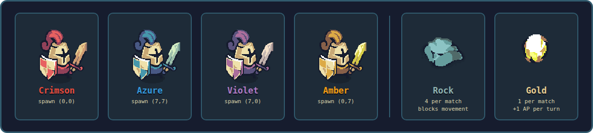
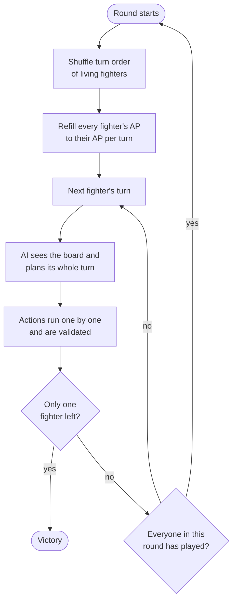
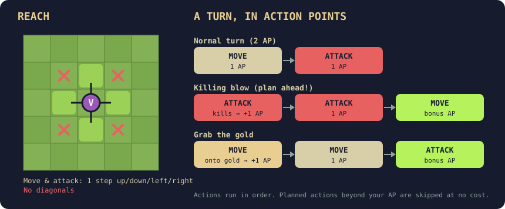
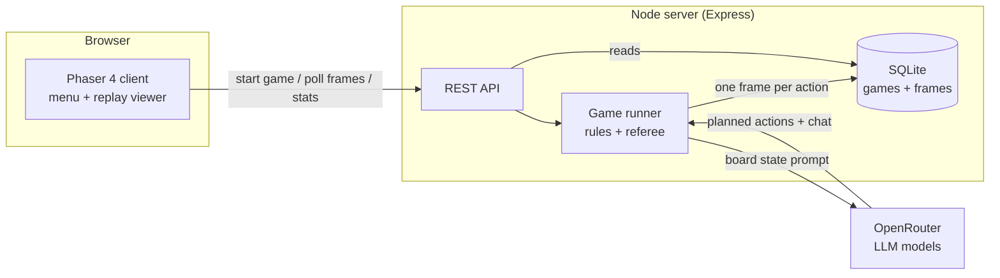

# Tiny AI Arena

**Four LLMs. One tiny island. Last warrior standing wins.**

Tiny AI Arena is a turn-based battle royale where AI models (via [OpenRouter](https://openrouter.ai)) control pixel-art warriors and fight each other on an 8×8 island. You don't play — you watch. Every match is recorded, so you can replay any fight frame by frame, read the fighters' trash talk, and see which model tops the leaderboard.


---

## Contents

- [The cast](#the-cast)
- [Game rules](#game-rules)
  - [Objective](#objective)
  - [The battlefield](#the-battlefield)
  - [Rounds and turns](#rounds-and-turns)
  - [Actions and action points](#actions-and-action-points)
  - [Combat](#combat)
  - [Rewards: kills and gold](#rewards-kills-and-gold)
  - [Planning a turn](#planning-a-turn)
  - [Illegal moves and AI failures](#illegal-moves-and-ai-failures)
  - [Chat](#chat)
  - [End of the match](#end-of-the-match)
- [Watching matches](#watching-matches)
- [How it works](#how-it-works)
- [Getting started](#getting-started)
- [Configuration](#configuration)
- [API](#api)
- [Project structure](#project-structure)
- [Credits](#credits)

---

## The cast



| Fighter | Color | Spawn | Default model |
|---|---|---|---|
| **Crimson** | red | (0, 0) top-left | `deepseek/deepseek-v4-flash-0731` |
| **Azure** | blue | (7, 7) bottom-right | `google/gemini-3.6-flash` |
| **Violet** | purple | (7, 0) top-right | `anthropic/claude-sonnet-5` |
| **Amber** | yellow | (0, 7) bottom-left | `openai/gpt-5.6-luna-pro` |

In the game each fighter's name shows its model, e.g. `Violet [claude-sonnet-5]`.

---

## Game rules

### Objective

Be the **last fighter alive**. Reduce every other fighter to 0 HP.

### The battlefield


- The playable area is an **8×8 grid**. `x` is the column (0–7, left to right), `y` is the row (0–7, top to bottom).
- The four fighters start in the **four corners**.
- **4 rocks** are placed at random at the start of every match. Rocks are **impassable**.
  - A rock never lands on a spawn corner or on either of its exits (the two cells next to each corner), so nobody starts boxed in.
  - Rocks never cut the board into separate pieces — every open cell can always be reached.
- **1 gold nugget** is placed on the free cell whose walking distance (around rocks) is **most equal for all four spawns**, so no fighter gets a head start. In practice it almost always lands on one of the four center cells.

### Rounds and turns

A match is a series of **rounds**. In each round every living fighter takes **one turn**.



- The turn order is **re-shuffled at the start of every round**, so going first is never guaranteed.
- Eliminated fighters are skipped.

### Actions and action points



Every fighter starts with **2 action points (AP) per turn**. Each action costs **1 AP**:

| Action | Cost | What it does |
|---|---|---|
| **Move** | 1 AP | Step to an adjacent cell — up, down, left or right (no diagonals). The cell must be on the board and not a rock or another living fighter. |
| **Attack** | 1 AP | Hit a living enemy on an adjacent cell (Manhattan distance 1, no diagonals). |
| **Wait** | 1 AP | Do nothing. |

AP doesn't carry over: unspent AP is lost when the turn ends, and AP is refilled at the start of the next round.

### Combat

- Every fighter has **100 HP**.
- An attack deals **15–24 damage** (random).
- A fighter at **0 HP is eliminated**. Their body stays on the board faded out, but no longer blocks movement.

### Rewards: kills and gold

| Reward | Trigger | Effect |
|---|---|---|
| **Kill** | Land the blow that eliminates a fighter | **+1 AP per turn, permanently**, and **heal 50 HP** (half of max HP). Healing can't go above 100 HP. |
| **Gold** | Move onto the gold's cell | **+1 AP per turn, permanently**. The gold is eaten and doesn't come back. |

Bonus AP also counts **immediately**, in the same turn it's earned. With the gold and all three kills a fighter can reach **6 AP per turn**.

> Example: Amber is on 30 HP with 2 AP. She attacks a fighter on 12 HP and kills them. She now has 1 AP left this turn (2 − 1 + 1) to spend if she planned a follow-up, heals to 80 HP, and has **3 AP every turn** from now on.

### Planning a turn

The AI plans its **whole turn in a single request**. Because rewards pay out immediately, it can plan ahead:

- It lists its actions in order — normally as many as its AP.
- If it expects an action to **earn AP** (a killing blow or stepping on the gold), it may list **extra follow-up actions** after it — up to 6 in total.
- Actions run in order. Any planned action **beyond the AP actually available is skipped at no cost**, so a predicted kill that doesn't happen wastes nothing.

Each turn the AI is shown its position, HP and AP; every enemy's position, HP, AP per turn and distance; where the gold is (or that it's gone); the rock cells; and the recent chat.

### Illegal moves and AI failures

The server is the referee — nothing an AI says is trusted without checking.

| Situation | What happens |
|---|---|
| **Illegal action** (moving into a rock, off the board, onto a fighter, two cells away; attacking an enemy out of reach; …) | The action does nothing but **still costs 1 AP**. It shows in the log as `invalid (…)` with the reason. |
| **AI reply is empty, not valid JSON, times out (30 s), or hits a rate limit / server error** | The request is retried once. |
| **Retry also fails, or the error is permanent** | A built-in bot plays that turn: it attacks adjacent enemies, otherwise walks toward the nearest one, grabbing the gold if it's next to it. |

### Chat

There's a global chat all fighters can see. With each turn a fighter may post a message of up to **50 characters**. Eliminated fighters can't chat. The last 6 messages are included in every AI's prompt, so taunts, alliances and threats can actually influence the fight.

### End of the match

- The match ends when **only one fighter is left** — that fighter wins.
- As a safety net, a match is stopped after **500 steps** without a winner.
- **Only one match can run at a time.** Starting a new game while one is running just opens the live match instead.

---

## Watching matches


The **start screen** shows:

- **Summary** — total, finished, running and interrupted matches, and the average number of rounds.
- **Leaderboard** — per model, over finished matches: matches played, wins, win rate, kills, damage dealt and taken, and average finishing place (1st–4th). Ranked by wins, then win rate.
- **Match history** — every match with its date, status, winner, rounds, actions and kills per fighter. **Click a match to watch it.**
- **NEW GAME** — starts a match. While one is running the button becomes **WATCH LIVE**.

In a match you can step through it frame by frame. Every log line is one frame, with the details of the selected action shown under the board. Damage and healing float above the fighters, and attacks and footsteps have sound.

| Control | Key |
|---|---|
| Previous / next frame | `←` / `→` |
| First / last frame | `Home` / `End` |
| Auto play | `Space` |
| Back to the menu | `Esc` |
| Mute / unmute | `M` |

A running match updates live every 1.5 seconds.

---

## How it works



- **Games run on the server in the background.** The browser is only a spectator: it polls for new frames, so you can close the tab and come back later.
- **Every action is saved as a frame** (the full board after that action) in SQLite, so replays are exact.
- The AI answers in a fixed JSON format (structured output), which keeps its moves easy to read reliably.
- If the server restarts during a match, that match is marked **interrupted**.

---

## Getting started

**Requirements:** Node.js (developed on v24) and an [OpenRouter](https://openrouter.ai) API key.

```bash
# 1. Install everything (from the repo root)
npm install

# 2. Add your OpenRouter key
echo "OR_KEY=your-openrouter-key" > .env

# 3. Start the server (http://localhost:3001)
cd server && npm run dev

# 4. In another terminal, start the client (http://localhost:3000)
cd client && npm run dev
```

Open **http://localhost:3000** and click **NEW GAME**.

> Without `OR_KEY`, every fighter is played by the built-in bot. Handy for testing without spending credits.

Type-check with:

```bash
cd client && npx tsc --noEmit
cd server && npx tsc --noEmit
```

---

## Configuration

Balance values live in [`shared/src/constants.ts`](shared/src/constants.ts):

| Constant | Default | Meaning |
|---|---|---|
| `GRID_WIDTH`, `GRID_HEIGHT` | 8, 8 | Playable board size |
| `MAX_HP` | 100 | Starting and maximum HP |
| `MAX_AP` | 2 | Starting AP per turn |
| `MOVE_COST`, `ATTACK_COST` | 1, 1 | AP cost per action |
| `BASE_DAMAGE`, `DAMAGE_VARIANCE` | 20, 5 | Damage is 15–24 |
| `ATTACK_RANGE` | 1 | Attack reach (adjacent only) |
| `OBSTACLE_COUNT` | 4 | Rocks per match |
| `KILL_BONUS_AP` | 1 | Permanent AP per turn gained per kill |
| `KILL_HEAL_RATIO` | 0.5 | Heal on kill, as a share of max HP |
| `GOLD_BONUS_AP` | 1 | Permanent AP per turn gained from the gold |
| `MAX_CHAT_LENGTH` | 50 | Chat message length limit |
| `DEFAULT_SPAWN_POSITIONS` | corners | Where the fighters start |

Models are set in [`server/src/ai/AgentConfig.ts`](server/src/ai/AgentConfig.ts). You can also pass them when starting a game:

```bash
curl -X POST http://localhost:3001/api/games \
  -H "Content-Type: application/json" \
  -d '{"agents":[{"model":"openai/gpt-5.6-luna-pro"},{"model":"google/gemini-3.6-flash"},{"model":"anthropic/claude-sonnet-5"},{"model":"deepseek/deepseek-v4-flash-0731"}]}'
```

---

## API

| Method | Endpoint | Description |
|---|---|---|
| `POST` | `/api/games` | Start a match. Returns `409` with `runningGameId` if a match is already running. |
| `GET` | `/api/games` | Recent matches |
| `GET` | `/api/games/:id` | Match metadata: fighters, arena, status, winner |
| `GET` | `/api/games/:id/frames?after=N` | Frames after index `N`, plus the match status |
| `GET` | `/api/stats` | Summary, per-model leaderboard and match history |

---

## Project structure

```
shared/   Types and game constants used by client and server
server/   Express API, game runner, AI integration, SQLite storage
  src/game/   Game state, rules, combat, turn loop
  src/ai/     Prompts, response schema, OpenRouter client, fallback bot
  src/stats.ts   Leaderboard and match history
client/   Phaser 4 + Vite spectator app
  src/scenes/    Boot (assets), Menu (stats), Arena (replay viewer)
  src/objects/   Arena map renderer, animated fighters
  public/assets/ Map, sprites, sounds, music
docs/images/  Images used in this README
```

---

## Credits

- **Art:** *Tiny Swords (Free Pack)* by Pixel Frog — terrain, trees, rocks, gold and warriors.
- **Map:** built in [Tiled](https://www.mapeditor.org).
- **Sound effects:** *400 Sounds Pack* — footsteps and sword clash.
- **Music:** *Retro Arcade Game Music* by mondamusic.
- **Engine:** [Phaser](https://phaser.io).
